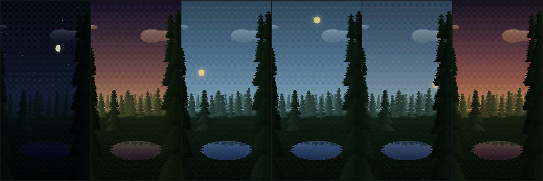
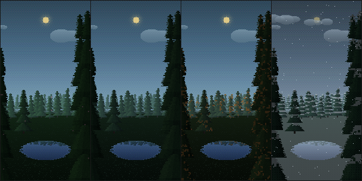
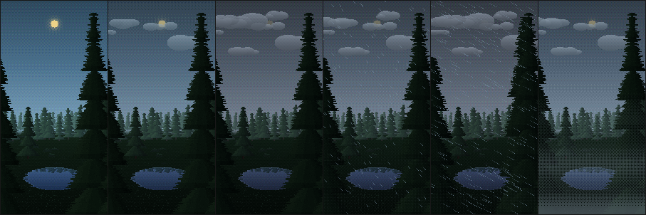

# WeatherPaper

A pixel-art forest live wallpaper for Android that follows your local weather, the time of day
and the season. Dark green, deliberately tiny, and built to cost almost nothing to run.

**The release APK is 79 KB.** No third-party dependencies at all.



---

## What it does

You are standing in a forest clearing. Silhouetted trees frame the edges of the screen, a
treeline runs across the middle, sky fills the gap above it, and a still pool mirrors that sky
back at you.

- **Time of day** — the sky ramps continuously from night through dawn to day and back. Stars
  come out; the sun or the moon, at its real phase, tracks an arc across the sky.
- **Weather** — cloud cover, drizzle through to heavy rain, snow, fog, and thunderstorm flashes.
  Wind slants the rain and sways the canopy.
- **Season** — spring blossom, summer green, autumn ambers, winter snow caps and a frozen pool.
  Hemisphere-aware, so it is right south of the equator too.
- **Home-screen readout** — an optional clock, temperature, condition and place name in a 5×7
  pixel font, positioned by dragging. Home screen only; the lock screen stays pure art.




---

## Installing

There is no Play Store build. CI produces an installable APK on every push:

1. Open [**Actions**](../../actions) and pick the most recent green run.
2. Download the `weatherpaper-apks-…` artifact and unzip it.
3. Sideload `app-release.apk` — already signed and R8-shrunk.
4. **Settings › Wallpaper › Live wallpapers › WeatherPaper**, then open its settings to choose a
   location and configure the readout.

The artifact name carries the release APK's size, so you can see it from the run list.

---

## Why it is small

Zero third-party dependencies. No AndroidX, no Compose, no Retrofit, no OkHttp, no JSON library,
no WorkManager, no Play Services. Everything comes from the Android framework:

`WallpaperService` · `Canvas` · `HttpURLConnection` · `org.json` · `LocationManager` ·
`SharedPreferences`

`android.useAndroidX=false` keeps it that way, and CI **fails the build** if the release APK ever
passes 1 MB — being small is the point, so it should break loudly rather than drift.

## Why it is cheap to run

- The scene renders into a small buffer (~280px tall) and is blitted at an **integer** scale with
  filtering off, so pixels stay square. A fractional scale is what makes most pixel-art
  wallpapers shimmer.
- Sky, distant treeline, ground and pool, plus each swaying tree layer, live in **cached buffers**
  rebuilt only when the weather actually changes. A frame is four buffer copies at their sway
  offsets, plus the live weather effects.
- The loop runs at **~12fps** — which reads as deliberate for pixel art, and costs far less than 60.
- A calm, dry, cloudless scene **stops redrawing entirely**, or wakes once a minute if the clock
  is showing. Nothing runs at all while the wallpaper is hidden, and power-save forces static.
- **No background work whatsoever.** Weather is fetched only when the wallpaper becomes visible
  and the cached reading is over 30 minutes old. No jobs, no alarms, no wakeups. The last reading
  is persisted, so the first frame after a reboot is never blank.

## Privacy

Location is optional. Without the permission you pick a place by name and nothing about you
leaves the device except a latitude and longitude sent to Open-Meteo. With it, the app uses the
framework's *last known* coarse fix — it never requests an active GPS fix. There is no analytics,
no account, no API key, and no network traffic beyond the weather lookup.

---

## Making the art your own

**→ See [ART.md](ART.md) for the full direction.**

The scene is composed as layers in Aseprite at a fixed 160 × 288 canvas, drawn with the palette
in `art/palette.gpl`. Sprites are palette-*indexed*: each pixel names a slot like "canopy shade 5"
or "snow settles here", and the renderer resolves it at draw time against depth, sun altitude and
season — so **one daytime drawing covers every hour and every season** with no variants.

There is no night version, no winter version and no rainy version to draw. Those are derived.

```sh
node tools/gen-palette.js      # the palette to load into Aseprite/GIMP/Krita
node tools/gen-template.js     # the 160x288 canvas and its guides
node tools/build-preview.js    # then open tools/preview/index.html
```

`tools/preview/index.html` is a self-contained page running the real renderer, with sliders for
time, cloud, wind, temperature, precipitation and season — so every state can be judged in
seconds without building anything.

Node 18+ is all you need for art work. There are no npm dependencies.

---

## Building

CI does it on every push. To build locally you need JDK 17 and the Android SDK:

```sh
./gradlew assembleRelease    # app/build/outputs/apk/release/
./gradlew assembleDebug
```

`minSdk 26` (Android 8), `targetSdk 35`. Release builds are signed with the debug key so CI can
emit something installable; this is a personal sideload build, not a Play Store artifact.

### Layout

```
app/src/main/java/com/sylcolabs/weatherpaper/
  ForestWallpaperService.kt   the wallpaper, frame loop and cost control
  SceneStates.kt              observation + clock -> scene state
  Prefs.kt                    all persisted state
  scene/                      the renderer (see ART.md for the JS/Kotlin mapping)
  weather/                    Open-Meteo client, location, caching
  ui/                         settings, and the live drag-to-position preview
art/                          scene.json, sprites, palette, reference shots
tools/                        renderer reference, importers, generators, preview
```

---

## Credits

Weather data by [**Open-Meteo**](https://open-meteo.com), used under CC BY 4.0. No API key and no
account required — thank you.
